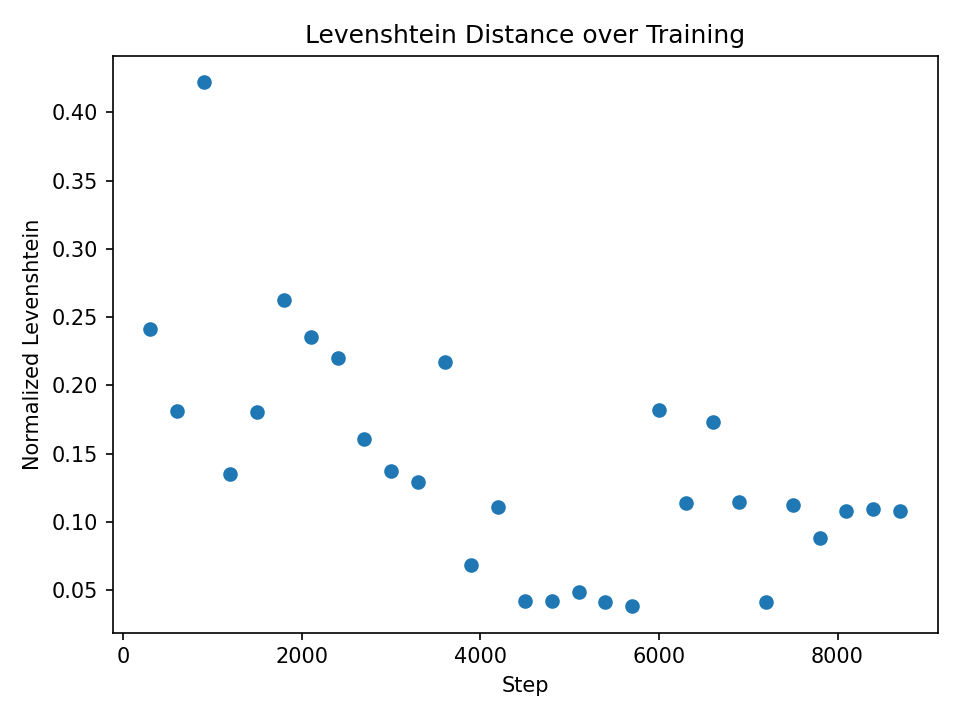
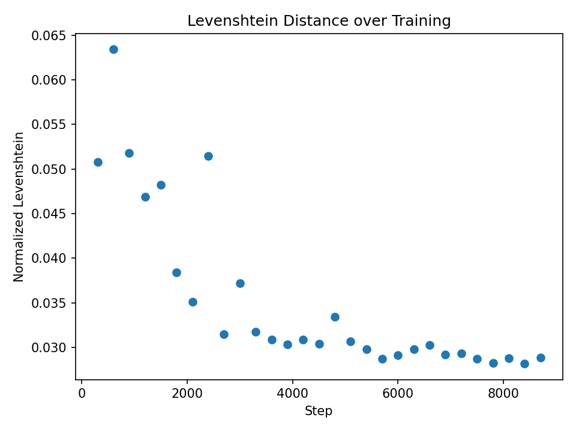
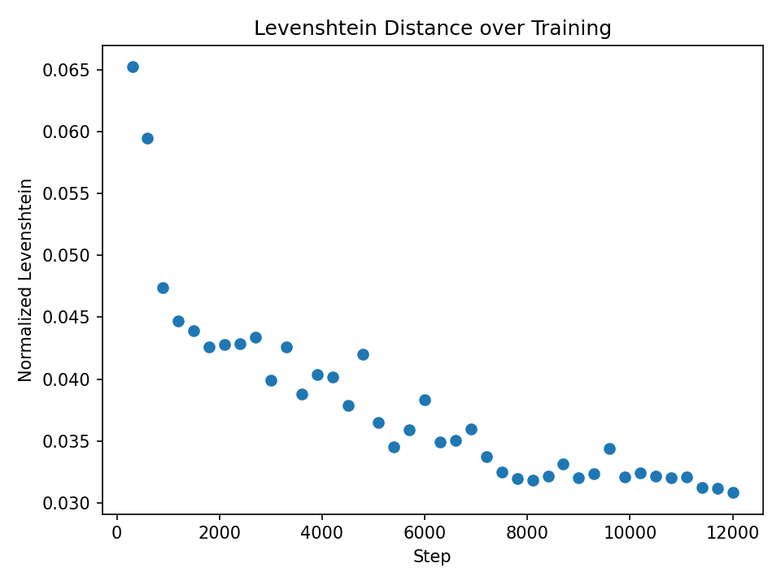
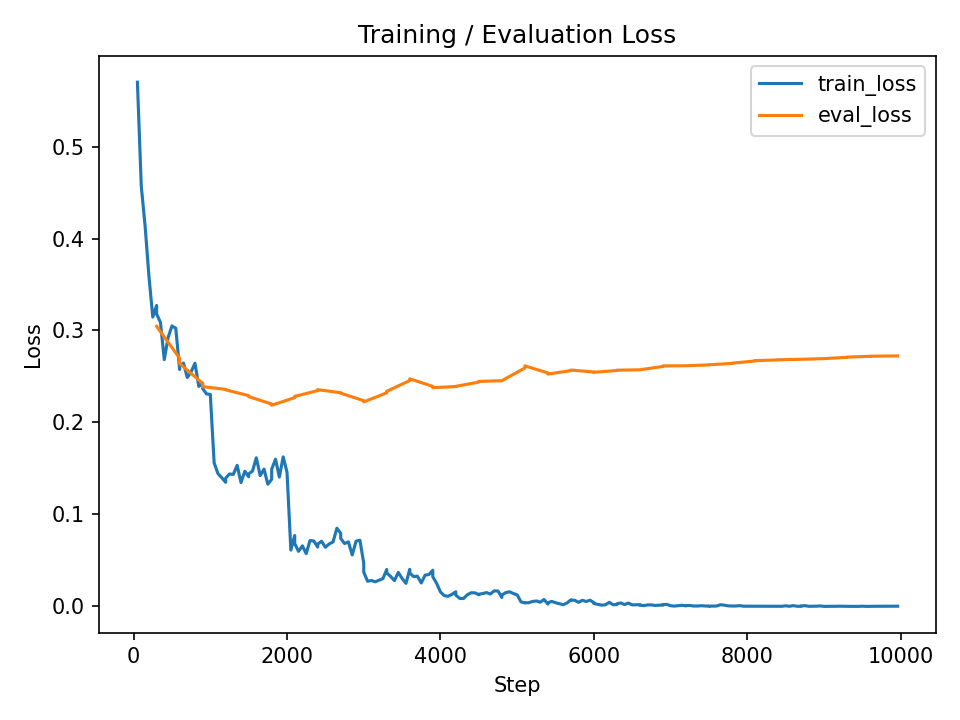
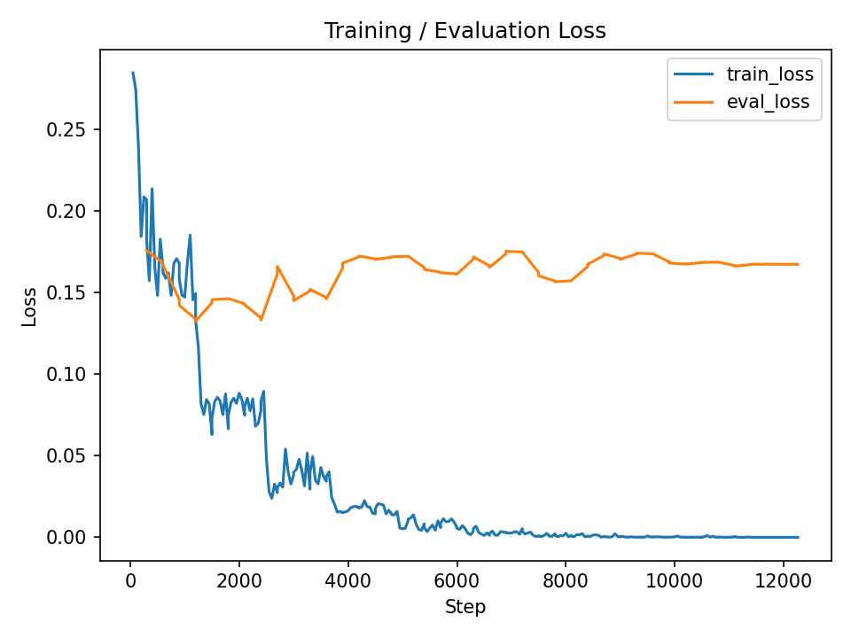
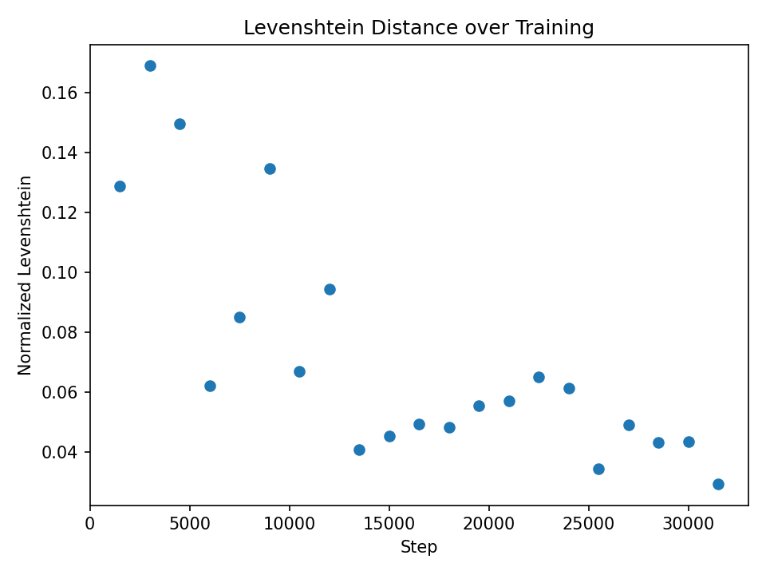
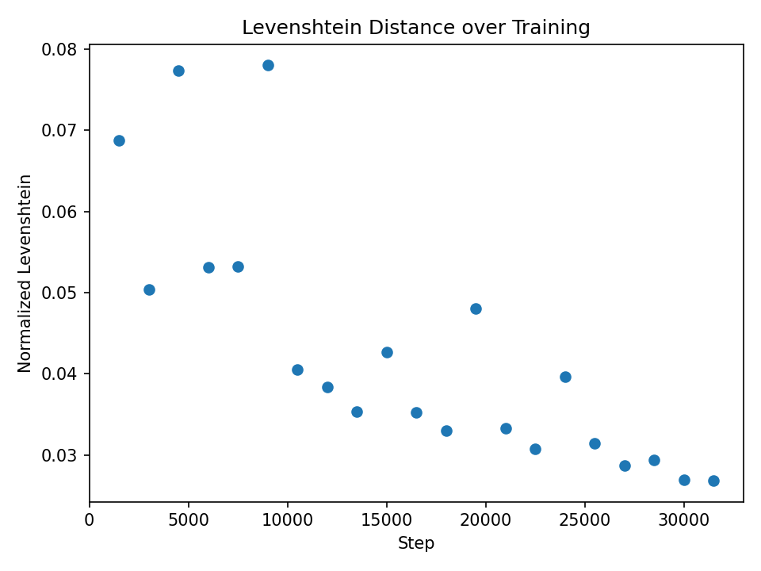
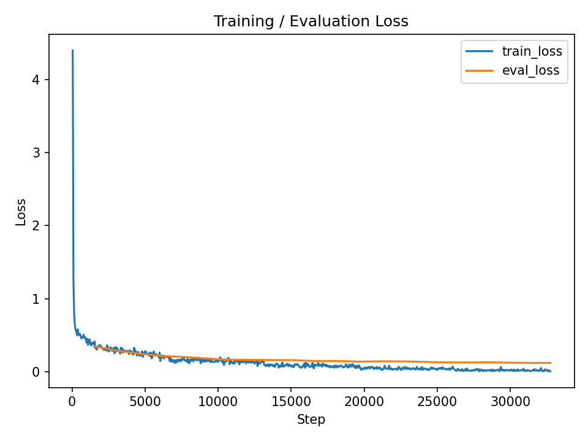
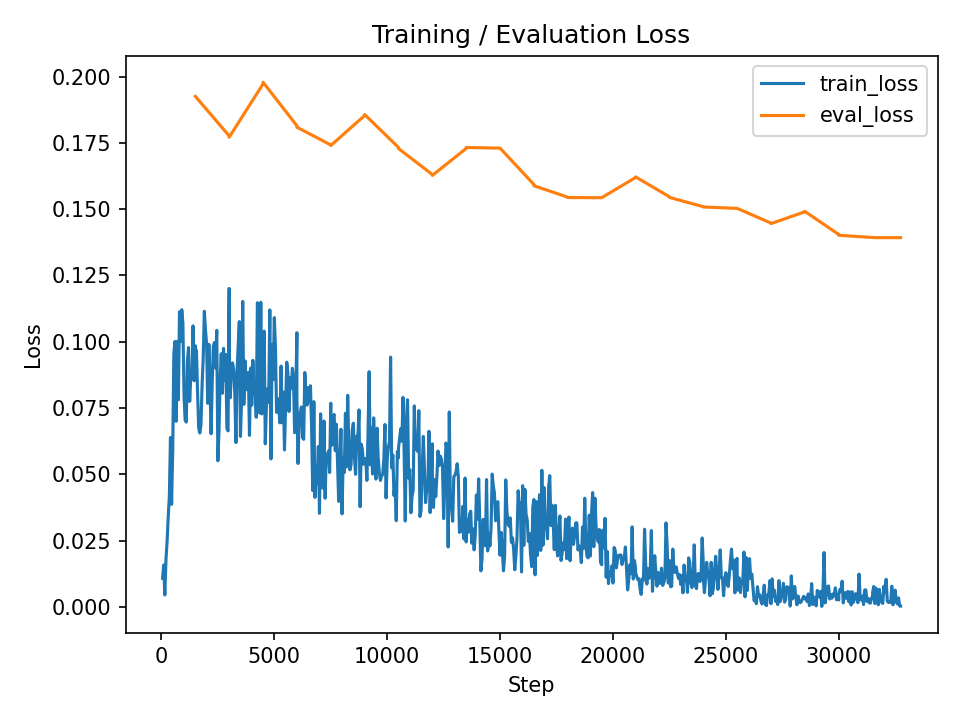

# NYCU-IAII-ML2025 — Taiwanese Speech Recognition

End-to-end speech recognition system built on OpenAI Whisper variants. The project focuses on creating robust Taiwan Minnan speech models by combining diverse augmentations and detailed evaluation tracking.

---

## Project Layout

```
.
├── data
│   ├── test-random
│   │   └── test-random
│   └── train
|       └── train
├── aggregate_data.py
├── auto-pipeline.ipynb (deprecated)
├── build_tokenizer.py (deprecated)
├── dict_parse.py
├── history
├── models.py
├── ods_to_csv.py
├── pipeline.ipynb
├── prediction.py
├── preprocess.py
├── readme.md
├── train.py
└── visualization.py
```

- `data/`: raw and augmented corpora, metadata, lexicon resources.  
- `model/`: checkpoints grouped by model choice and timestamp.  
- `history/`: CSV logs and visualizations for each training stage.  
- Entry scripts: `preprocess.py`, `train.py`, `prediction.py`, `visualization.py`.

---

## Quick Start Workflow

Use `pipeline.ipynb` for a notebook walkthrough, or execute the steps below.

### 1. Augment and Normalize Training Audio

```bash
# All files are resampled to 16 kHz during augmentation.
python preprocess.py \
  --in_path ./data/train/train \
  --in_label_path ./data/train/train-toneless.csv \
  --out_path ./data/train/tmp-augmented-audio \
  --out_label_path ./data/train/tmp-augmented-audio/metadata.csv
```

### 2. Train Whisper Models

```bash
# Train from scratch with WER evaluation.
python train.py \
  --dataset tmp-augmented-audio \
  --model_choice openai_whisper_small \
  --eval_function wer

# Resume from a checkpoint and switch to normalized Levenshtein distance.
python train.py \
  --dataset tmp-augmented-audio \
  --model_choice openai_whisper_small \
  --model_state_path model/openai_whisper_small/2025-11-08T11-10-10_0.0213 \
  --eval_function lev
```

### 3. Run Inference

```bash
# Plain decoding.
python prediction.py \
  --model_dir model/openai_whisper_small/2025-11-08T11-10-10_0.0213

# Constrained decoding that applies the lexicon file.
python prediction.py \
  --model_dir model/openai_whisper_small/2025-11-08T11-10-10_0.0213 \
  --use_lexicon
```

### 4. Visualize Confusion Matrices

```bash
python visualization.py \
  --model_dir model/openai_whisper_small/2025-11-08T11-10-10_0.0213
```

---

## Data Augmentation Resources

| Purpose                                   | Source                                                                 | Notes                                                                 |
|-------------------------------------------|------------------------------------------------------------------------|-----------------------------------------------------------------------|
| Background + short transient noises       | https://github.com/karoldvl/ESC-50/archive/master.zip                  | Extract `ESC-50-master/audio/` to `data/background_noises/`.          |
| Room impulse responses (reverberations)   | https://github.com/RoyJames/room-impulse-responses                     | Convolve with clean speech for TPGBIR-style augmentation.             |

Example for ESC-50:

```bash
cd data
unzip master.zip
mv ESC-50-master/audio/ background_noises
```

---

## Leaderboard Snapshot

### openai_whisper_small

WER: Word Error Rate
MLD: Mean Levenshtein Distance

| Experiment                                                                                                                         | Notes                                                                                                             | Public Score |
|------------------------------------------------------------------------------------------------------------------------------------|-------------------------------------------------------------------------------------------------------------------|--------------|
| [WER evaluation](history/openai_whisper_small_2025-11-07T15-06-55_2025-11-07T15-58-32.csv)                                         | Baseline without lexicon                                                                                          | 9.39393      |
| [WER + lexicon](history/openai_whisper_small_2025-11-07T15-06-55_2025-11-07T19-33-53.csv)                                          | Lexicon hurts due to missing words/English terms                                                                  | 9.87878      |
| [MLD](history/openai_whisper_small_2025-11-08T11-10-10_0.0213_2025-11-08T11-31-15.csv)                                             | Switch metric for better tonal robustness                                                                         | 8.43434      |
| [MLD, TPGBIR (3× augs, 25 epochs)](history/openai_whisper_small_2025-11-10T17-31-06_0.0597_2025-11-10T17-32-28.csv)                     | Adds RIR and background augmentations                                                                                | 5.93939      |
| [MLD, TPGBIR (5× augs, 10 epochs)](history/openai_whisper_small_2025-11-10T21-57-21_0.0380_2025-11-10T21-58-44.csv)                     | use more augmentation with less epoch                                                                                     | 4.98989      |
| [MLD, train_TPGBIR 5× + dict-sentence_TPGBIR 1×](history/openai_whisper_small_2025-11-11T21-26-09_0.0416_2025-11-11T21-27-34.csv)       | Adds additional sentence dataset from sutian dictionary                                                                            | 5.67676      |
| [MLD, train 5× -> dict-sentence 1× -> train 5×](history/openai_whisper_small_2025-11-12T07-55-19_0.0282_2025-11-12T07-56-40.csv)          | Stage-wise curriculum                                                                                             | 4.33333      |
| [MLD, train 5× -> dict-sentence 1× -> train 5× -> dict-word 1×](history/openai_whisper_small_2025-11-12T14-29-42_0.0308_2025-11-12T14-31-05.csv) | Adds additional word dataset from sutian dictionary                                                                 | 6.10101      |
| [MLD, Hybrid TPGBIR (1× dict-sent + 1× dict-word + 6× train), 5 epochs](history/openai_whisper_small_2025-11-14T01-06-49_0.0274_2025-11-14T01-08-11.csv) | packs original training data, word dataset and sentence dataset from sutian dictionary, with augmentation 5x, 1x, 1x      | 4.06060      |
| [WER, hybrid TPGBIR (1× dict-sentence + 1× dict-word + 6× train), 5 epochs](history/openai_whisper_small_2025-11-15T12-58-10_0.1176_2025-11-15T12-59-32.csv) | packs original training data, word dataset and sentence dataset from sutian dictionary, with augmentation 5x, 1x, 1x but use WER  | 4.92929     |

#### Stage-wise tracking for the hybrid curriculum:

| Metric / Stage                 | Stage 0 (train 5×)                                            | Stage 1 (dict-sentence 1×)                                   | Stage 2 (train 5×)                                           | Stage 3 (dict-word 1×)                                       |
|--------------------------------|----------------------------------------------------------------|---------------------------------------------------------------|----------------------------------------------------------------|----------------------------------------------------------------|
| Levenshtein distance           |                     |                    |                    |                    |
| Loss                           |                            |                           |                           |                           |
| Submit score                   | 4.98989                                                       | 5.67676                                                       | 4.33333                                                       | 6.10101                                                       |

### openai_whisper_large_v3_turbo

| Experiment                                                                                                                        | Public Score |
|------------------------------------------------------------------------------------------------------------------------------------|--------------|
| [NLD + hybrid TPGBIR (1× dict-sentence + 1× dict-word + 6× train), 5 epochs](history/openai_whisper_large_v3_turbo_2025-11-15T07-08-22_0.0294_2025-11-15T09-04-34.csv) | 2.84848      |
| [NLD + hybrid TPGBIR (1× dict-sentence + 1× dict-word + 6× train), 5 epochs round 2](history/openai_whisper_large_v3_turbo_2025-11-16T11-38-20_0.0268_2025-11-16T12-13-51.csv) | 3.14141      |


#### Stage-wise tracking for training with hybrid TPGBIR (1× dict-sentence + 1× dict-word + 5× train)

| Metric / Stage                 | Stage 0 (hybrid TPGBIR)                                   | Stage 1 (hybrid TPGBIR)                                       |
|--------------------------------|---------------------------------------------------------------|----------------------------------------------------------------|
| Levenshtein distance           |                    |                    |
| Loss                           |                           |                           |
| Submit score                   | 2.84848 | 3.14141 |

### openai_whisper_large_v3_turbo_QLoRA_NF4

| Experiment                                                                                                                        | Public Score |
|------------------------------------------------------------------------------------------------------------------------------------|--------------|
| [NLD + hybrid TPGBIR (1× dict-sentence + 1× dict-word + 6× train), 5 epochs](history/openai_whisper_large_v3_turbo_4bit_2025-12-05T23-06-27_0.1649_2025-12-05T23-09-16.csv) | 10.08080      |

---

## Whisper Model Notes

```
Model directory contents
├── added_tokens.json         # Extra tokenizer units
├── config.json               # Model architecture + hyperparameters
├── generation_config.json    # Decoding arguments (e.g., num_beams)
├── merges.txt                # BPE merge rules
├── model.safetensors         # Weights
├── normalizer.json           # Text normalization
├── preprocessor_config.json  # Feature extractor config
├── special_tokens_map.json   # Special token mapping
├── tokenizer_config.json     # Tokenizer metadata
├── tokenizer.json            # Serialized vocab + merges
├── training_args.bin         # Hugging Face Trainer arguments
└── vocab.json                # Token frequencies
```

Key terms:

```python
total_steps = num_train_epochs * ceil(len(train_dataset) / effective_batch_size)
effective_batch_size = per_device_train_batch_size * gradient_accumulation_steps * num_devices
```

- `decoder_start_token_id`: default Whisper uses `<|startoftranscript|>` (50258). Custom tokenizer swaps to `<s>` / `</s>` to align with seq2seq conventions.  
- `num_beams`: count of hypotheses retained at each decoding step. Higher values explore diverse continuations (e.g., greedy = 1, beam search > 1).  
- Tokenizer types referenced in `tokenizer_config.json`: word-level, subword-level (BPE, WordPiece, SentencePiece), and character-level vocabularies.

---

## DataCollatorSpeechSeq2SeqWithPadding

`AudioDataset` yields single samples with variable-length mel features and tokenized transcripts. The collator pads them into uniform batches:

```
Sample 1: input_features [80, 523], labels [15]
Sample 2: input_features [80, 1842], labels [28]
Sample 3: input_features [80, 891], labels [22]
```

1. **Pad audio features** to the longest time dimension in the batch, resulting in `[batch, 80, max_T]`.  
2. **Pad labels** to the longest sequence using `-100` so PyTorch ignores padding in the loss.  
3. **Strip duplicate BOS tokens** if transcripts already include `<s>`:

```python
if (labels[:, 0] == self.processor.tokenizer.bos_token_id).all().cpu().item():
    labels = labels[:, 1:]
```

This prevents the trainer from inserting `<s>` twice.

---

## AudioDataset Overview

1. **Read metadata** from CSV files containing `file_path` and `transcription`.  
2. **Load waveforms** and convert to mel spectrograms (`[80, T]` where `T` depends on duration).  
3. **Return feature + label pairs** that the collator pads before feeding them into Whisper.

These steps decouple audio preprocessing, text normalization, and batching so experiments remain reproducible across augmentations and model scales.
