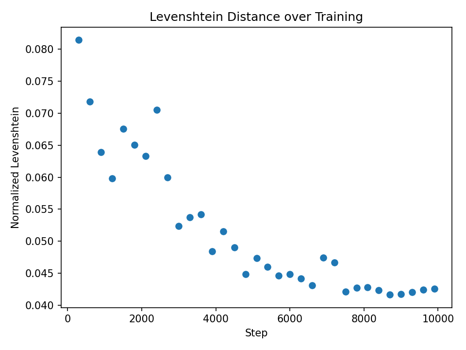
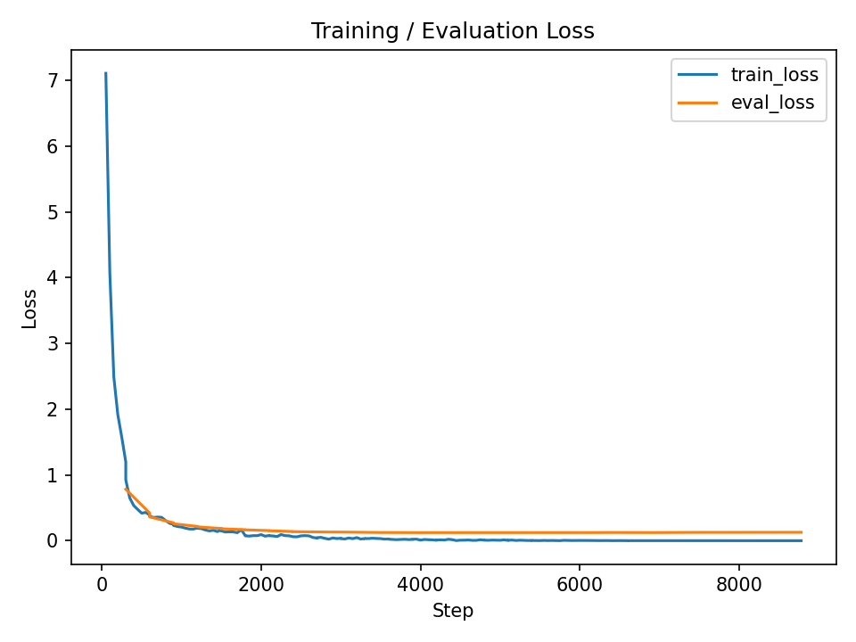
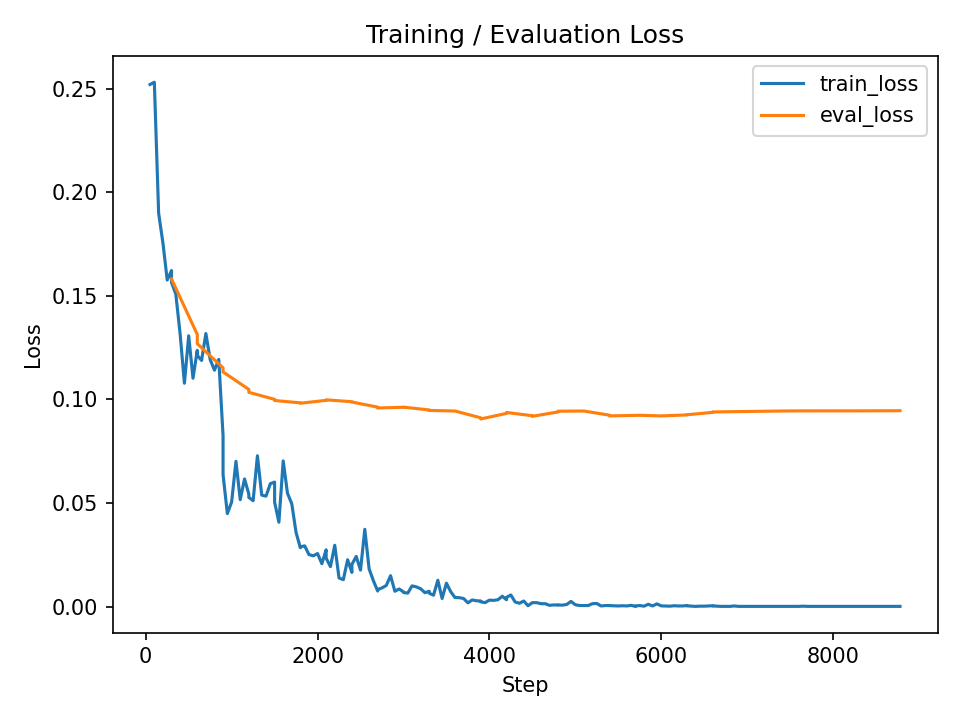

# NYCU-IAlI-ML2025 - Recurrent Neural Networks (Taiwanese Speech Recognition)

## project directory structure

```
.
├── data
│   ├── test-random
│   └── train
│       ├── fixed-train
│       ├── lexicon.txt
│       ├── noisy-train
│       ├── sample.csv
│       ├── train
│       ├── train.csv
│       └── train-toneless.csv
├── history
├── model
├── output
├── taiwanese_tokenizer
├── models.py
├── build_tokenizer.py
├── prediction.py
├── preprocess.py
├── readme.md
├── train.py
└── visualization.py
```

## command examples

run pipeline.ipynb or run commands below step by step:

```bash
# perform training data argumentation from 
# InPath = "./data/train/train"
# InLabelPath = "./data/train/train-toneless.csv"
# to
# OutPath = "./data/train/tmp-augmented-audio"
# OutLabelPath = "./data/train/tmp-augmented-audio/metadata.csv"
# during the aumentation, all audio files are resampled to 16kHz
python preprocess.py

# use dataset "tmp-augmented-audio" to train model "openai_whisper_small" with evaluation function "wer"
python3 train.py --dataset tmp-augmented-audio --model_choice openai_whisper_small --eval_function wer
# continue with pre-trained state and use dataset "tmp-augmented-audio" to train model "openai_whisper_small" with evaluation function "lev"
python3 train.py --dataset tmp-augmented-audio --model_choice openai_whisper_small --model_state_path model/openai_whisper_small/2025-11-08T11-10-10_0.0213 --eval_function lev

# predict on test data without lexicon
python3 prediction.py --model_dir model/openai_whisper_small/2025-11-08T11-10-10_0.0213
# predict on test data with lexicon
python3 prediction.py --model_dir model/openai_whisper_small/2025-11-08T11-10-10_0.0213 --use_lexicon

# visualize confusion matrix with a pretrained model state
python3 visualization.py --model_dir model/openai_whisper_small/2025-11-08T11-10-10_0.0213
```

## Augmentation examples

1. Background Noises + Short Noises (transient sounds)
https://github.com/karoldvl/ESC-50/archive/master.zip

```
cd data
unzip master.zip
mv ESC-50-master/audio/ background_noises
```

3. Room Impulse Responses (RIR)
https://github.com/RoyJames/room-impulse-responses

## results

### openai_whisper_small

[eval with WER](history/openai_whisper_small_2025-11-07T15-06-55_2025-11-07T15-58-32.csv)
submit score: 9.39393

[eval with WER & apply lexicon](history/openai_whisper_small_2025-11-07T15-06-55_2025-11-07T19-33-53.csv)
submit score: 9.87878

[eval with normalized Levenshtein distance](history/openai_whisper_small_2025-11-08T11-10-10_0.0213_2025-11-08T11-31-15.csv)
submit score: 8.43434

[eval with normalized Levenshtein distance & apply lexicon]()
submit score: not better since lexicon is not complete and some words are in english

[eval with normalized Levenshtein distance + train with TPGBIR augmentation (3x augs, 25 epoch)](history/openai_whisper_small_2025-11-10T17-31-06_0.0597_2025-11-10T17-32-28.csv)
submit score: 5.93939

[eval with normalized Levenshtein distance + train with TPGBIR augmentation (5x augs, 10 epoch)](history/openai_whisper_small_2025-11-10T21-57-21_0.0380_2025-11-10T21-58-44.csv)
submit score: 4.98989

[eval with normalized Levenshtein distance + train with train_TPGBIR augmentation (5x augs, 10 epoch) + train with dict-sentence_TPGBIR augmentation (1x augs, 10 epoch)](history/openai_whisper_small_2025-11-11T21-26-09_0.0416_2025-11-11T21-27-34.csv)
submit score: 5.67676

[eval with normalized Levenshtein distance + train with train_TPGBIR augmentation (5x augs, 10 epoch) + train with dict-sentence_TPGBIR augmentation (1x augs, 10 epoch) + train with train_TPGBIR augmentation (5x augs, 10 epoch)](history/openai_whisper_small_2025-11-12T07-55-19_0.0282_2025-11-12T07-56-40.csv)
submit score: 4.33333

[eval with normalized Levenshtein distance + train with train_TPGBIR augmentation (5x augs, 10 epoch) + train with dict-sentence_TPGBIR augmentation (1x augs, 10 epoch) + train with train_TPGBIR augmentation (5x augs, 10 epoch) + train with dict-word_TPGBIR augmentation (1x augs, 10 epoch)](history/openai_whisper_small_2025-11-12T14-29-42_0.0308_2025-11-12T14-31-05.csv)
submit score: 6.10101

[eval with normalized Levenshtein distance + train with hybrid_TPGBIR (1x dict-sentence + 1x dict-word + 5x train) augmentation (5 epoch)](history/openai_whisper_small_2025-11-14T01-06-49_0.0274_2025-11-14T01-08-11.csv)
submit score: 4.06060

### openai_whisper_large_v3_turbo

[eval with WER + train with hybrid_TPGBIR (1x dict-sentence + 1x dict-word + 5x train) augmentation (5 epoch)](history/openai_whisper_large_v3_turbo_2025-11-15T07-08-22_0.0294_2025-11-15T09-04-34.csv)
submit score: 2.84848

stage-wise training plots:

| | stage 0 (train_TPGBIR 5x) | stage 1 (dict-sentence_TPGBIR 1x) | stage 2 (train_TPGBIR 5x) | stage 3 (dict-word_TPGBIR 1x) |
|---|---|---|---|---|
| levenshtein distance |  |  |  |  |
| loss |  |  |  |  |
| submit score | 4.98989 | 5.67676 | 4.33333 | 6.10101 |

### openai_whisper_medium

### whisper note

```
usages of file in a model dir:
.
├── added_tokens.json -> tokenizer added tokens info
├── config.json -> model architecture and hyperparameters
├── generation_config.json -> generation parameters like num_beams
├── merges.txt -> tokenizer merges for BPE
├── model.safetensors -> model weights
├── normalizer.json -> text normalizer rules
├── preprocessor_config.json -> feature extractor config
├── special_tokens_map.json -> tokenizer special tokens info
├── tokenizer_config.json -> tokenizer config
├── tokenizer.json -> tokenizer vocab and merges
├── training_args.bin -> training arguments used in Trainer
└── vocab.json -> tokenizer vocabulary
```

#### terms

```python
total_steps = (num_train_epochs) * ceil(len(train_dataset) / effective_batch_size)

effective_batch_size = per_device_train_batch_size *gradient_accumulation_steps* num_devices
```

- decoder_start_token_id
in original tokenizer, model.config.decoder_start_token_id is "<|startoftranscript|>": 50258, in my custom tokenizer, i use `<s>` and `</s>` as bos and eos token

- vocab
- beam_num
num_beams means how many candidates are considered in each next possible tokens
ex: Candidate next tokens:
"ba" (score 0.6)
"pa" (score 0.3)
"ka" (score 0.1)
Greedy (num_beams=1): choose "ba"
Greedy (num_beams=2): choose ["ba","pa"]
- tokenizer types (in tokenizer_config.json)
word level (each valid word is a token)
sub-word level (Byte pair encoding, word piece, sentence piece)
character level (each char is a token)

# DataCollatorSpeechSeq2SeqWithPadding

AudioDataset provides individual samples with variable-length audio features and text labels.
DataCollatorSpeechSeq2SeqWithPadding combines individual samples into uniform batches for training. 
```
Sample 1:
  input_features: [80, 523]   ← 523 time steps (0.52 sec audio)
  labels: [15]                ← 15 tokens

Sample 2:
  input_features: [80, 1842]  ← 1842 time steps (1.84 se=c audio)
  labels: [28]                ← 28 tokens

Sample 3:
  input_features: [80, 891]   ← 891 time steps
  labels: [22]                ← 22 tokens
```
To create a batch, DataCollatorSpeechSeq2SeqWithPadding pads both the audio features and text labels to the length of the longest sample in the batch.

## 1. Pad Audio Features

Pad all audio to **Longest in batch time steps** (max length):

```
Sample 1: [80, 523]  → [80, Longest in batch]
Sample 2: [80, 1842] → [80, Longest in batch]
Sample 3: [80, 891]  → [80, Longest in batch]

Result: Stack into batch [3, 80, Longest in batch]
```

## 2. Pad Text Labels

Pad all labels to **Longest in batch** and use -100 for padding, since -100 tells PyTorch to ignore these positions in loss calculation:

```
Sample 1: [15] → original, -100, -100, ..., -100  (add 13 × -100)
Sample 2: [28] → original                         (already longest)
Sample 3: [22] → original, -100, -100, ..., -100  (add 6 × -100)

Result: Stack into batch [3, 28]
```

## 3. Remove BOS Token from Labels (if present)

During training, the model automatically adds BOS token. so if your labels already have it, you'd have it twice:

```python
if (labels[:, 0] == self.processor.tokenizer.bos_token_id).all().cpu().item():
  labels = labels[:, 1:]
```

```
Labels with BOS:    [<s>, tok1, tok2, ..., </s>]
Model adds BOS:     [<s>, <s>, tok1, tok2, ..., </s>]  ← Wrong!

So remove it:       [tok1, tok2, ..., </s>]
Model adds BOS:     [<s>, tok1, tok2, ..., </s>]       ← Correct!
```

# AudioDataset

## 1. get labels from csv file and convert to label ids

Read CSV file with columns: "file_path", "transcription"

## 2. Load Audio Files and extract Mel Spectrogram Features

Audio converted to frequency representation:

- **80 frequency bins** (vertical axis)
- **Variable time steps** (horizontal axis)

output shape: [80, T] where T is the number of time steps depending on audio length
